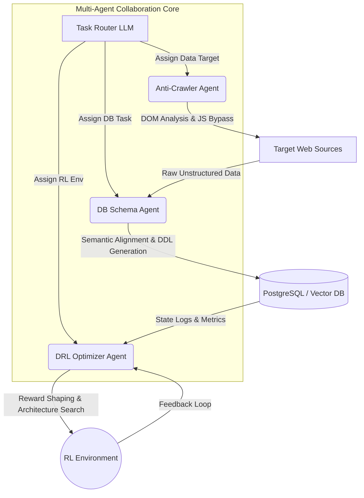

# 🚀 Data-DRL-Agent Framework

  

Data-DRL-Agent 是一个面向复杂网络环境的自动化数据管道与策略调优框架。系统基于多智能体（Multi-Agent）协作架构，旨在解决极具挑战性的反爬虫规避、非结构化数据语义对齐落盘，以及基于深度强化学习（DRL）的网络资源分配策略自动化重构。

## 🧠 核心架构图

✨ 核心特性 (Features)
Self-Healing Crawler Agent: 针对高复杂度 Web 环境，自动解析 DOM 树，遇到 403/验证码拦截时通过 LLM 反思（Reflection）机制自动调整抓取策略。

Auto-DDL DB Agent: 摄入海量异构数据后，基于长上下文推理自动设计并执行最优的关系型/向量数据库表结构。

DRL Strategy Assistant: 自动分析上千个 Epoch 的网络拥塞日志，提供深度强化学习网络结构及 Reward 函数的自动重构建议，极大降低人工调优成本。

⚙️ 快速上手 (Quick Start)
注意： 当前开源版本为企业级架构的抽象 PoC，移除了所有特定业务逻辑与鉴权密钥。完整企业版部署需联系维护者。

Bash
# 1. Clone the repo
git clone [https://github.com/yourusername/Data-DRL-Agent-Framework.git](https://github.com/yourusername/Data-DRL-Agent-Framework.git)

# 2. Install dependencies (Requires Python 3.9+)
pip install -r requirements.txt

# 3. Configure API Keys
export MIMO_API_KEY="sk-your-mimo-key-here"

# 4. Run the Agent Pipeline
python main.py --task "fetch_and_optimize" --target_env "drl_network_sim"

### 4. 一键转化为在线演示网页 (GitHub Pages)
有了上面那个极具压迫感的 README 之后，把它变成一个独立的“在线产品地址”：

1.  在你的 GitHub 仓库页面，点击右上角的 **Settings**。
2.  在左侧导航栏找到 **Pages** (在 Code and automation 分类下)。
3.  在 **Build and deployment** 下，`Source` 选择 **Deploy from a branch**。
4.  `Branch` 选择 `main` (或 master)，文件夹选择 `/(root)`，点击 **Save**。
5.  （可选但强烈推荐）点击页面上方的 **Choose a theme**，随便选一个看起来顺眼的（比如 `Cayman` 或 `Midnight`），点击 Select theme。

**大功告成！** 
等待 1-2 分钟后，GitHub Pages 就会为你生成一个 URL，通常是 `[https://你的用户名.github.io/Data-DRL-Agent-Framework/](https://你的用户名.github.io/Data-DRL-Agent-Framework/)`。
A multi-agent framework for automated web data extraction and Deep Reinforcement Learning (DRL) environment optimization.
